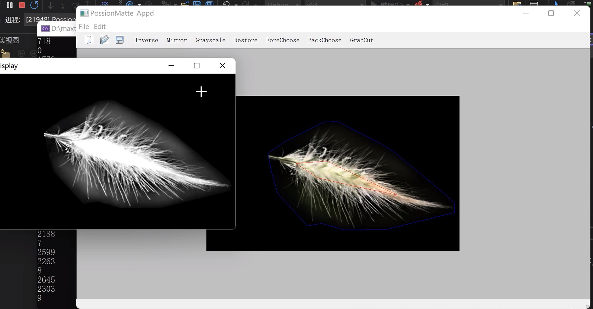

# Poisson-Matting

Poisson Matting global for C++ implement

reference the [xuhongxu96/PoissonMatting: Final Work for Digital Image Processing Course (github.com)](https://github.com/xuhongxu96/PoissonMatting)

blog at[泊松抠图论文复现_lvzelong2014的博客-CSDN博客](https://blog.csdn.net/lvzelong2014/article/details/127744020?csdn_share_tail=%7B%22type%22%3A%22blog%22%2C%22rType%22%3A%22article%22%2C%22rId%22%3A%22127744020%22%2C%22source%22%3A%22lvzelong2014%22%7D)

ENV

> Qt5
> 
> Eigen3
> 
> ANN
> 
> Visual Studio C++

## how to install

```
mkdir build
cd build
cmake ..
```

## Core Code

in src/App

PossionMatte.h/PossionMatte.cpp

## how to use

mainwindow like this

use open to load an image, and then choose Back/Fore Polygon , select the region and Click Cut

resutl like this


